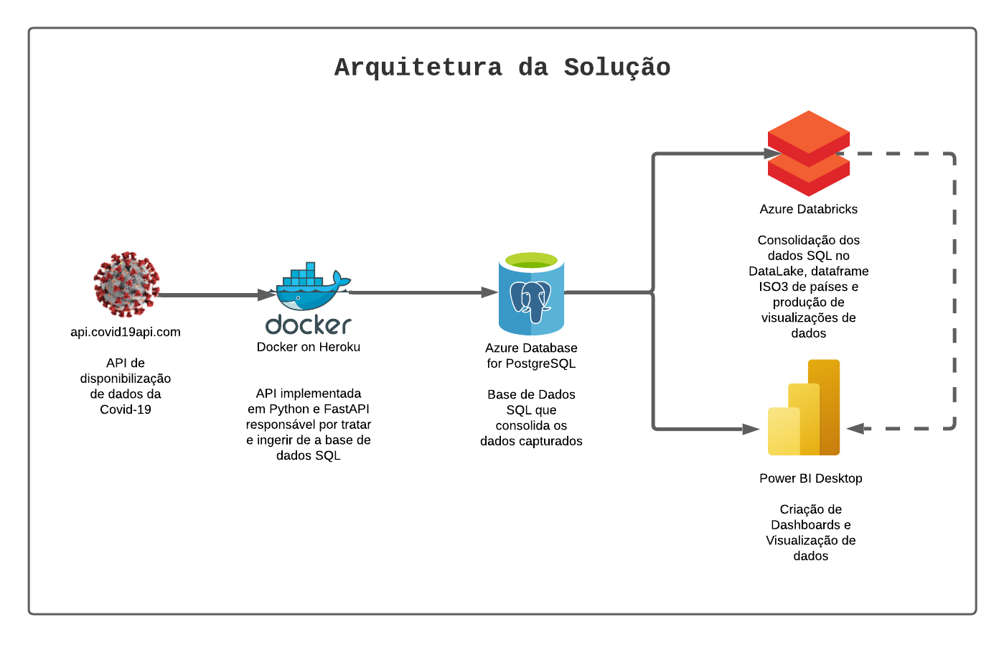

# Gama Accenture 2021 - Api de Captura dos dados da Covid

## Overview

Esse Projeto faz parte do treinamento de Engenheiro de dados ministrado pela Accenture em parceria com a Gamma Academy.

Neste projeto foi dado a oportunidade de aplicar as tecnologias abordados no curso como Python, SQL, Databricks, tratamento de dados e consumo de API. A ideia foi consumir a API com dados do [COVID-19](https://documenter.getpostman.com/view/10808728/SzS8rjbc), provisionar um banco de dados relacional na Microsoft Azure para receber a carga de dados, consumir os dados do Banco via Databricks, criar Pipilines de transformação de dados e então  criar vizualizaçãos dos mesmos.

## Integrantes

- Yang Ricardo Barcellos Miranda: [LinkedIn](https://www.linkedin.com/in/yangricardo/)
- Gutelvan Rodrigues: [LinkedIn](https://www.linkedin.com/in/gutelvam/)
- Carlos Lima Diaz: [LinkedIn](https://www.linkedin.com/in/carlos-lima-dias)
- Alisson Machado: [LinkedIn](https://www.linkedin.com/in/alisson-machado-sousa/)
- Gabriel Rangel: [LinkedIn]()
- Murilo Vinicius Corrêa Trassi: [LinkedIn](https://www.linkedin.com/in/murilo-trassi-144146b8)
- André Ariel: [LinkedIn](https://www.linkedin.com/in/andre-ariel-84070369)
- Rômulo Vieira: [Linkedin](https://www.linkedin.com/in/r%C3%B4mulo-vieira-67b7182a/)

## Indice
  - [Fases do Projeto](#fases)
    - [Parte 1: Projeto SQL, Python e Azure](#parte1) 
      - [Dados capturados para ingestão inicial](#ingestao)
      - [Menu - Cliente de dados consolidados](#menu)
    - [Parte 2: Projeto de Engenharia de dados](#parte2)
      - [Ingestão](#ingestao-databrics)
      - [Transformações e Desnormalizações](#transfomacoes-databrics)
      - [Visualizações](#visualizacoes)
      - [Organização do data lake no DBFS](#dbfs)
  - [Arquitetura de Solução](#arquitetura)
    - [API de Captura de Dados Automatizada](#api)
  - [Problema encontrados](#problemas)
  - [Melhoras futuras](#melhoras)

## Fases do projeto 

### Parte 1: Projeto SQL, Python e Azure 

- Criação de um Script SQL para criação de um DataBase com um Schema para armazenar os registros de países e os dados de COVID-19 por todo o mundo. Na tabela que será armazenada os dados de países, 2 campos são obrigatórios de serem consistidos: Nome do País e Código ISO2. Em outros repositórios devem ser armazenados a quantidade de casos confirmados e mortes de cada um dos países do mundo, desde o dia 01/01/2020.
  > 
  > [Script SQL](scripts/part_1/01_sql_schemas.sql)
- Criação de um banco de dados relacional no provedor de nuvem Azure para armazenamento dos dados em questão, estabelecidos pelo script com o dito schema, criado na etapa anterior. O banco de dados pode ser SQL Server, MySQL, MariaDB, Postgres ou algum outro SQL.
  >
  > - Solução: `jdbc:postgresql://data-warriors-postgresql.postgres.database.azure.com:5432/postgres?user=DataWarriorsAdmin@data-warriors-postgresql&password=********&sslmode=require`
  >
- Desenvolvimento de um script Python que faça leitura da API determinada para realizar o armazenamento de países e dos casos confirmados e de mortes da COVID-19. O armazenamento destas informações deverá ser em BD SQL, consistido no Azure através do schema definido na etapa 1 desta atividade. Após armazenamento dos valores no BD, este dito script Python deverá retornar as seguintes informações em tela, caso o usuário escolha:
    1) Panorama diário de quantidade de casos confirmados de COVID-19 dos 10 países do mundo com maiores números.
    2) Panorama diário de quantidade de mortes de COVID-19 dos 10 países do mundo com números.
    3) Total de mortes por COVID-19 dos 10 países do mundo com maiores números.
    4) Total de casos confirmados por COVID-19 dos 10 países do mundo com maiores números.
A impressão das 4 informações citadas acima deverá acontecer em tela, através do prompt de comando de execução do programa.

#### Dados capturados para ingestão inicial 

A API traz dados de diversas formas do COVID-19, as funcionalidades escolhidas para ser utilizada no projeto, foram 3:

- Summary:

    

- Country:

    

- By Country:

    
  > [Notebook de Captura e Armazenamento inicial de dados na base SQL](scripts/part_1/01_initial_upload.ipynb)
#### Menu - Cliente de dados consolidados 
  >   - [Notebook](part_1/02_menu.ipynb)
  > - Solução extra:
  >   - [Módulo de API](scenery.py)
  >   - [Endpoint de API no heroku](https://api-data-warriors.herokuapp.com/)
### Parte 2: Projeto de Engenharia de dados 

Com base nos conhecimentos obtidos durante o módulo de Engenharia de Dados com o Apache Spark, foi necessário elaborar um projeto de construção de um mini data lake utilizando a plataforma da Databricks para armazenamento, processamento e visualização dos dados.
Assim sendo, foi requisitado a capacidade de desenvolver um pipeline de transformação de dados com as seguintes etapas:

#### Ingestão 

 Realizar a ingestão dos datasets da parte anterior (parte 1) que estão no banco SQL na Azure em um diretório de arquivos raw dentro do DBFS.

  > - [IPython Notebook](scripts/parte_2/01_Databricks_Ingestion_db_raw.ipynb)
  > - [Databricks Notebook](https://databricks-prod-cloudfront.cloud.databricks.com/public/4027ec902e239c93eaaa8714f173bcfc/1025248272368135/98395105832869/3134047155639060/latest.html)

#### Transformações e Desnormalizações 

 Realizar transformações nos datasets acima, utilizando as APIs do PySpark, de modo a converter o dado ingestado previamente no formato mais otimizado para Big Data, o formato parquet, particionando-o fisicamente quando necessário. Salvar os dados em um diretório de arquivos ready dentro do DBFS.
  > - [IPython Notebook](scripts/parte_2/02_Databricks_TransformationDesnormalization_raw_ready.ipynb)
  > - [Databricks Notebook](https://community.cloud.databricks.com/?o=1025248272368135#notebook/904836608181079/command/904836608181080)

#### Visualizações 

 Criar as visualizações que permitam ter bons insights e acompanhamentos em relação a pandemia do COVID-19.
  > - [IPython Databricks](scripts/parte_2/03_Databricks_ready_visualization.ipynb)
  > - [Databricks Notebook](https://databricks-prod-cloudfront.cloud.databricks.com/public/4027ec902e239c93eaaa8714f173bcfc/1025248272368135/98395105832884/3134047155639060/latest.html)
  > 
  > Extras:
  >
  > - [Dashboard Power BI conectado a base PostgreSQL](powerbi-dashboards/Projeto_Accenture_01.pbix)
  > - [Dashboard Power BI conectado ao Databricks](powerbi-dashboards/Projeto_Accenture_01%20-%20Databricks.pbix)
  > - [PDF de Visualizações no Power BI - 2021-03-13](https://github.com/yangricardo/gama_accenture_data_warriors_api_schedule/blob/main/docs/Projeto_Accenture_01%20-%20Databricks.pdf)

#### Organização do data lake no DBFS 

- A organização do data lake, ou estrutura de diretórios para o armazenamento dos dados, proposto para o projeto deve foi definida seguindo o padrão abaixo:

## Arquitetura de Solução 

### API de Captura de Dados Automatizada 

#### Dependências

- `asdf install python 3.7.10`: instala versão mais estável do python para as dependências do projeto
  > necessário instalar o `asdf`, ferramenta que ajuda a ter várias versões de linguagens e outras ferramentas no ambiente e alternar
- `sudo apt-get install pipenv`: instala pipenv para gerenciamento das dependências do projeto
  - `pipenv --python 3.7`: gera ambiente python do projeto
  - `pipenv shell`: ativa ambiente python pelo pipenv
  - `pipenv install`: instala dependências a partir do arquivo `Pipfile`
  - `pipenv install -r .pipenv`: instala dependências a partir de um arquivo gerado via comando `pip freeze > .pipenv`
- `pipenv install fastapi`: instala dependências do [FastAPI](https://fastapi.tiangolo.com/)
- `pipenv install uvicorn`: instala ASGI server para execução da api
- `pipenv install psycopg2-binary`: Dependências para conexão com Postgres
- `pipenv install pandas`: Dependência para manipulação de dataframes
- `pipenv install requests`: Dependência para execução de requisições http
- `pipenv install schedule`: Dependência para execução de jobs escalonados

#### Lançamento da API
  
- `uvicorn main:app --reload`: executa servidor de API

## Problema encontrados 

1. Dificuldade de coleta dos dados EUA;
2. Limitação da quantidade de requisições da API em `curto período de tempo` X `alta granularidade`;
3. Limitação de visualização de 1000 linhas na feature do display do Databricks

### Extras

#### Integração entre Databricks e PowerBI

> Input de dados de conexão:
> host: `community.cloud.databricks.com`
> http path: `sql/protocolv1/o/1025248272368135/0313-145733-sags119`

> Os dados não foram reconhecidos

##### Solução

> Ao tirar dúvidas com o mentor Igor Uchôa, identificamos a necessidade de salvar o spark dataframe como uma tabela no databricks usando o comando de exemplo`df.write.saveAsTable("default.test")`. Após esse passo conseguimos concluir a integração.

## Melhoras futuras 

1. Combinação da API disponibilizada com outras APIs externas para maior confiabilidade de dados e robustez.

2. Realizar modelos forecast com dados.

