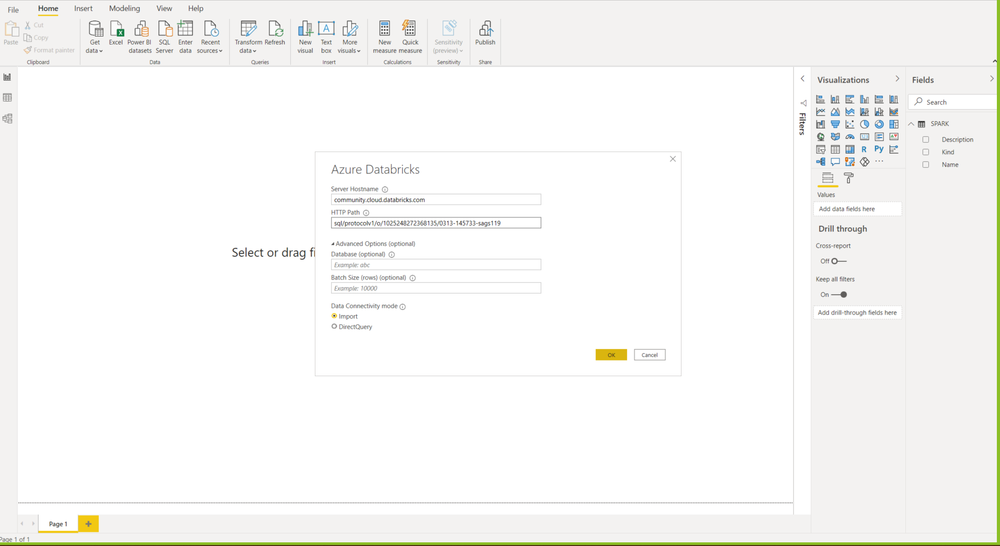
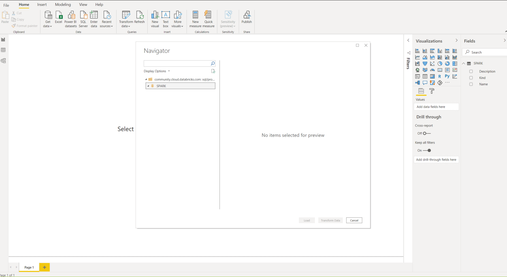

# Dificuldades

1. Dificuldade de coleta dos dados EUA;
2. Limitação da quantidade de requisições da API em `curto período de tempo` X `alta granularidade`;
3. Limitação de visualização de 1000 linhas na feature do display do Databricks

## Extras

### Integração entre Databricks e PowerBI

> Input de dados de conexão:
> host: `community.cloud.databricks.com`
> http path: `sql/protocolv1/o/1025248272368135/0313-145733-sags119`

> Os dados não foram reconhecidos

#### Solução

> Ao tirar dúvidas com o Igor Uchôa, identificamos a necessidade de salvar o spark dataframe como uma tabela no databricks usando o comando de exemplo`df.write.saveAsTable("default.test")`. Após esse passo conseguimos concluir a integração.
